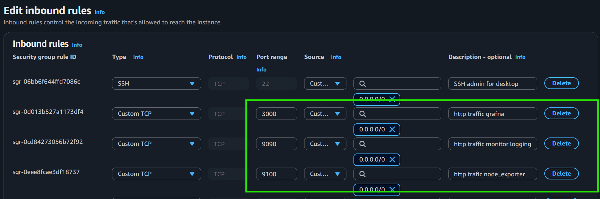

# Prometheus & Grafana Monitoring Stack
## A Complete Guide to Modern Observability and System Monitoring
## Overview
## What is Prometheus?
Prometheus is a monitoring platform that collects metrics from monitored targets by scraping metrics HTTP endpoints on these targets.

Prometheus collects and stores its metrics as time series data, i.e. metrics information is stored with the timestamp at which it was recorded, alongside optional key-value pairs called labels.

# Features
## Prometheus's main features are:

- a multi-dimensional data model with time series data identified by metric name and key/value pairs
- PromQL, a flexible query language to leverage this dimensionality
- no reliance on distributed storage; single server nodes are autonomous
- time series collection happens via a pull model over HTTP
- pushing time series is supported via an intermediary gateway
- targets are discovered via service discovery or static configuration
- multiple modes of graphing and dashboarding support
## What are metrics?
Metrics are numerical measurement.The term time series refers to the recording of changes over time.
What users want to measure differs from application to application. For a web server, it could be request times; for a database, it could be the number of active connections or active queries, and so on.

Metrics play an important role in understanding why your application is working in a certain way. Let's assume you are running a web application and discover that it is slow. To learn what is happening with your application, you will need some information. For example, when the number of requests is high, the application may become slow. If you have the request count metric, you can determine the cause and increase the number of servers to handle the load.

## Components
The Prometheus ecosystem consists of multiple components, many of which are optional:

The main Prometheus server  which scrapes and stores time series data
client libraries for instrumenting application code
a push gateway  for supporting short-lived jobs
special-purpose exporters for services like HAProxy, StatsD, Graphite, etc.
an alertmanager  to handle alerts
various support tools
Most Prometheus components are written in Go , making them easy to build and deploy as static binaries.

🔍 **Prometheus & Grafana Monitoring Stack**

A complete educational project demonstrating the setup and integration of modern monitoring tools including Prometheus for metrics collection, Node Exporter for system monitoring, and Grafana for data visualization. This hands-on implementation covers everything from installation to dashboard creation, providing practical experience with industry-standard observability practices.

**Key Features:**
• Step-by-step Prometheus server setup and configuration
• Node Exporter integration for Linux system metrics
• Grafana dashboard creation and data source configuration
• Real-world examples with AWS EC2 deployment
• PromQL query examples and best practices

**Technologies:** Prometheus | Grafana | Node Exporter | AWS | Linux | DevOps

**Purpose:** Educational resource for learning modern monitoring and observability practices in DevOps environments.


## Architecture
This diagram illustrates the architecture of Prometheus and some of its ecosystem components:


## Prometheus basic architecture

Prometheus scrapes metrics from instrumented jobs, either directly or via an intermediary push gateway for short-lived jobs. It stores all scraped samples locally and runs rules over this data to either aggregate and record new time series from existing data or generate alerts. Grafana  or other API consumers can be used to visualize the collected data.


## When does it fit?
Prometheus works well for recording any purely numeric time series. It fits both machine-centric monitoring as well as monitoring of highly dynamic service-oriented architectures. In a world of microservices, its support for multi-dimensional data collection and querying is a particular strength.

Prometheus is designed for reliability, to be the system you go to during an outage to allow you to quickly diagnose problems. Each Prometheus server is standalone, not depending on network storage or other remote services. You can rely on it when other parts of your infrastructure are broken, and you do not need to setup extensive infrastructure to use it.

## When does it not fit?
Prometheus values reliability. You can always view what statistics are available about your system, even under failure conditions. If you need 100% accuracy, such as for per-request billing, Prometheus is not a good choice as the collected data will likely not be detailed and complete enough. In such a case you would be best off using some other system to collect and analyze the data for billing, and Prometheus for the rest of your monitoring.

## Downloading Prometheus
Download the latest release of Prometheus for your platform, then extract it:


```bash
# Download the tarball
wget https://github.com/prometheus/prometheus/releases/download/v3.9.0-rc.0/prometheus-3.9.0-rc.0.linux-arm64.tar.gz
# Extract it
tar xvfz prometheus-*.tar.gz
# Change to file location
cd prometheus-*
# Make it exacutable
chmod +x prometheus

```

The Prometheus server is a single binary called prometheus.

The Prometheus download comes with a sample configuration in a file called prometheus.yml that is a good place to get started

## Running Prometheus
To start Prometheus,change to the directory containing the Prometheus binary and run:
```bash
./prometheus --config.file=prometheus.yml
```
This starts a Prometheus server with the configuration in prometheus.yml. By default, the server will be available at http://localhost:9090.


## Prometheus expression browser
 To use Prometheus's built-in expression browser,to look at some data that Prometheus has collected about itself.
 One metric that Prometheus exports about itself is called.
 ```bash
 promhttp_metric_handler_requests_total
 ```
  (the total number of /metrics requests the Prometheus server has served).

 ## Table view
 
  Returns a number of different time series (along with the latest value recorded for each), all with the metric name.

  HTTP request results only
  ```bash
  promhttp_metric_handler_requests_total{code="200"}
  ```

  To count the number of returned time series
  ```bash
    count(promhttp_metric_handler_requests_total)
  ```
  ## Graphing interface
  To graph the per-second HTTP request rate returning status code 200 happening in the self-scraped Prometheus:
  ```bash
    rate(promhttp_metric_handler_requests_total{code="200"}[11m])
  ```
  

  # Exploring Node Exporter metrics through the Prometheus expression browser | Monitoring other targets

  ## Monitoring Linux host metrics with the Node Exporter
  The Prometheus Node Exporter exposes a wide variety of hardware- and kernel-related metrics.

I will:

- Start up a Node Exporter on localhost / remote
- Start up a Prometheus instance on localhost /remote that's configured to scrape metrics from the running Node Exporter
- Metrics specific to the Node Exporter are prefixed with node_ and include metrics like node_cpu_seconds_total and node_exporter_build_info.
- Example metrics:
  
  
  
  ## Installing and running the Node Exporter
```bash
# Download the tarball
wget https://github.com/prometheus/node_exporter/releases/download/v1.10.2/node_exporter-1.10.2.linux-arm64.tar.gz

# Extract it
tar -xvzf node_exporter-1.10.2.linux-arm64.tar.gz
cd node_exporter-1.10.2.linux-arm64

# Make it executable
chmod +x node_exporter

# Run it
./node_exporter
```

## AWS EC2 Security Group Configuration

To make your monitoring stack accessible from external sources, configure your EC2 security group with the following inbound rules:

**Required Security Group Rules:**



**Security Best Practices:**
- Restrict source IPs to your specific IP address instead of 0.0.0.0/0 for production environments
- Use VPC security groups for internal communication between services
- Consider using AWS Systems Manager Session Manager instead of SSH for enhanced security
- Enable HTTPS/TLS for production deployments

**AWS CLI/Console Configuration Example:**[Prefrence]
```bash
# Add security group rules via AWS CLI
aws ec2 authorize-security-group-ingress --group-id sg-xxxxxxxxx --protocol tcp --port 22 --cidr 0.0.0.0/0
aws ec2 authorize-security-group-ingress --group-id sg-xxxxxxxxx --protocol tcp --port 9090 --cidr 0.0.0.0/0
aws ec2 authorize-security-group-ingress --group-id sg-xxxxxxxxx --protocol tcp --port 9100 --cidr 0.0.0.0/0
aws ec2 authorize-security-group-ingress --group-id sg-xxxxxxxxx --protocol tcp --port 3000 --cidr 0.0.0.0/0
```


Node Exporter is now running and exposing metrics on port http://16.28.47.88:9100/meterics

https://github.com/user-attachments/assets/5be1008c-50be-4c3a-9e57-7335baf5784b


The Node Exporter is now exposing metrics that Prometheus can scrape

## Find specific metrics you care about
```bash
# Check CPU usage:
curl http://http://16.28.47.88:9100/meterics | grep "node_cpu"
# Check Memory usage:
curl http://http://16.28.47.88:9100/meterics | grep "node_memory"
# Check Disk usage:
curl http://http://16.28.47.88:9100/meterics | grep "node_disk"
# Check network traffic
curl http://http://16.28.47.88:9100/meterics | grep "node_network"
```
### Pro tip: Run these commands twice with a few seconds in between to see how the numbers change - that shows your system is actively being monitored!

### 4. View in your browser (easier!)
Instead of using curl, just open your browser and go to:
```
http://localhost:9100/metrics
http://http://16.28.47.88:9100/meterics
```

# What is Grafana
## Grafana support for Prometheus
 An open-source analytics and visualization platform used to monitor and analyze metrics from various data sources. It allows users to create, explore, and share interactive dashboards, supporting integrations with databases like Prometheus

 Grafana is widely used for observability, providing alerting, plugin extensibility, and a flexible query editor for real-time data visualization.

## Installing Grafna
```bash
# Install 
sudo apt-get install -y adduser libfontconfig1 musl
# Download 
wget https://dl.grafana.com/grafana-enterprise/release/12.3.1/grafana-enterprise_12.3.1_20271043721_linux_amd64.deb
#  It unpacks the  file, places the binaries and configs in the correct system directories, and registers Grafana with the package database.
sudo dpkg -i grafana-enterprise_12.3.1_20271043721_linux_amd64.deb

By default, Grafana will be listening on http://localhost:3000

The default login is "admin" / "admin".

To start Grafna mannualy

# /bin/grafana-server web

```


# Creating a Prometheus data source
## To create a Prometheus data source in Grafana:


- Click on "Data Sources".
- Click on "Add data source".
- Select "Prometheus" as the type.
- Set the appropriate Prometheus server URL (for example, http://localhost:9090/)
- Adjust other data source settings as desired (for example, choosing the right Access method).
- Click "Save & Test" to save the new data source.


## Educational Purpose

This project was created for educational purposes to demonstrate the implementation and integration of Prometheus monitoring and Grafana visualization tools. It serves as a practical learning resource for understanding modern monitoring and observability practices in DevOps and system administration.

## Personal Development Journey

This project represents a significant milestone in my personal development and learning journey in DevOps and system monitoring. Through hands-on implementation of Prometheus and Grafana, I've gained practical experience in:

- Setting up monitoring infrastructure from scratch
- Understanding metrics collection and time-series data
- Configuring data visualization and dashboards
- Working with cloud infrastructure and remote servers
- Troubleshooting connectivity and authentication issues

This experience has strengthened my technical skills and deepened my understanding of modern observability practices that are essential in today's technology landscape.

## Project Conclusion

Thank you for exploring this monitoring and logging project! This comprehensive guide covered the setup and configuration of Prometheus for metrics collection, Node Exporter for system monitoring, and Grafana for data visualization. These tools form the foundation of modern observability practices and are essential skills for anyone working in DevOps, system administration, or site reliability engineering.

Feel free to experiment with the configurations, explore additional metrics, and extend this setup for your own monitoring needs. Happy monitoring! 🚀


---

